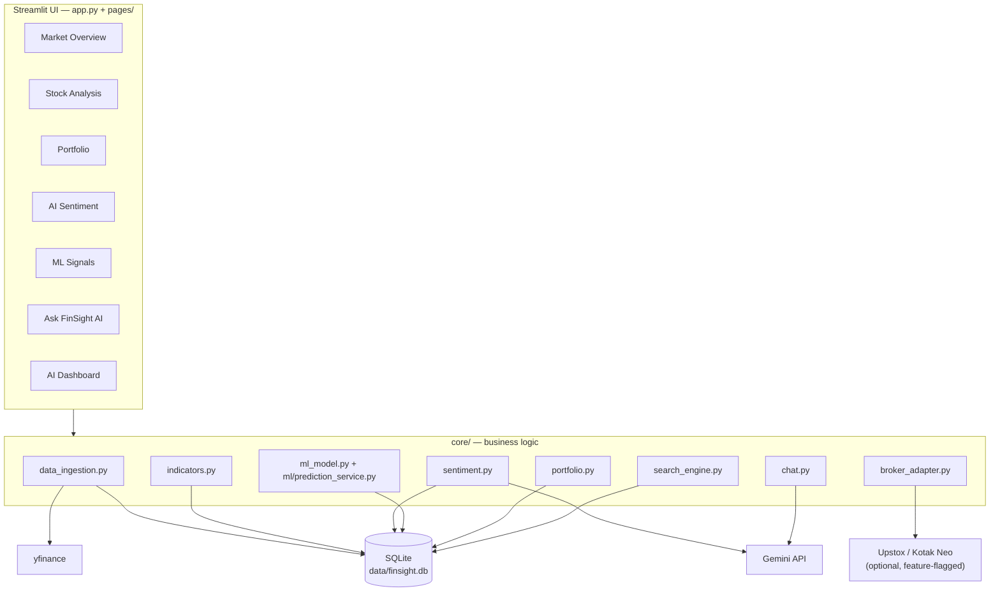
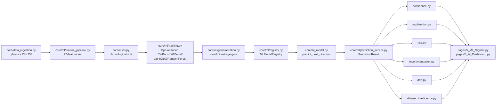
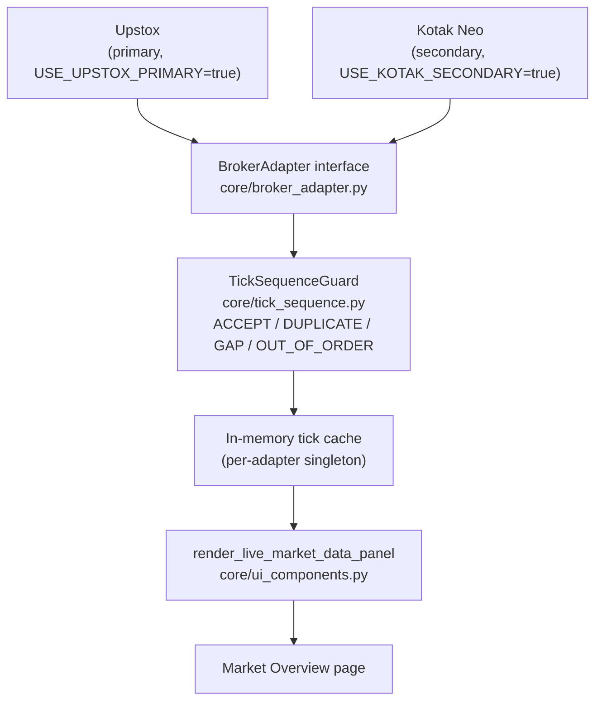

---
Repository Snapshot:
  Commit: b3e9abc
  Branch: master
  Generated: 2026-07-17
  Generator: Claude Code
  Scope: Documentation Only
---

# FinSight

**AI-powered market intelligence for the Indian stock market (NSE/BSE).**

[](https://www.python.org/)
[](https://streamlit.io/)
[](LICENSE)
[](#testing)

> FinSight is a signal-research and education tool. Nothing in this app or this
> document is financial advice.

---

## Table of Contents

- [Overview](#overview)
- [Key Capabilities](#key-capabilities)
- [Quick Start](#quick-start)
- [Architecture](#architecture)
- [Technology Stack](#technology-stack)
- [Feature Highlights](#feature-highlights)
- [AI/ML Workflow](#aiml-workflow)
- [Live Market Data Architecture](#live-market-data-architecture)
- [Broker Architecture](#broker-architecture)
- [Project Structure](#project-structure)
- [Installation](#installation)
- [Configuration](#configuration)
- [Environment Variables](#environment-variables)
- [Running Locally](#running-locally)
- [Testing](#testing)
- [Screenshots](#screenshots)
- [FAQ](#faq)
- [Troubleshooting](#troubleshooting)
- [License](#license)
- [Contributing](#contributing)
- [Support](#support)
- [Acknowledgements](#acknowledgements)
- [Disclaimer](#disclaimer)

---

## Overview

FinSight is a Streamlit application for the Indian equity market (NSE/BSE) that
combines real market data ingestion, professional-grade technical analytics, LLM-scored
news sentiment, a versioned machine-learning direction classifier, and a full
explainability layer around every prediction — all in one process, backed by SQLite.

Every prediction the app surfaces answers the same fixed set of questions: what does it
predict, how confident is it, why, what's the risk, has this model been right before,
which model/dataset version produced it, how fresh is the underlying data, and is the
model drifting. See [AI/ML Workflow](#aiml-workflow).

## Key Capabilities

- Real NSE/BSE market data ingestion and technical analysis (SMA/EMA/RSI/MACD/Bollinger/
  ATR/ADX/VWAP/Support-Resistance)
- A next-trading-session ML direction classifier with a full explainability layer:
  confidence scoring, plain-language and technical explanations, risk assessment,
  historical accuracy, drift detection, and model/dataset versioning
- Optional live market data from Upstox (primary) or Kotak Neo (secondary/fallback),
  behind a single feature flag, with tick sequence validation
- LLM-scored news sentiment and a grounded conversational analyst ("Ask FinSight AI"),
  both with fully-functional rule-based fallbacks when no LLM key is configured
- Portfolio tracking (Sharpe ratio, max drawdown, correlation matrix, Monte Carlo
  simulation) and a DB-backed watchlist
- A universal search box, backed by a custom React/TypeScript Streamlit component,
  across the full ~2,300-listing NSE equity universe

## Quick Start

```bash
git clone https://github.com/1fawwaz/finsight.git
cd finsight
python -m venv venv && source venv/bin/activate   # Windows: venv\Scripts\activate
pip install -r requirements.txt
cp .env.example .env                              # add GEMINI_API_KEY, or leave blank
python -m core.data_ingestion                      # seeds the default watchlist
streamlit run app.py
```

Open **http://localhost:8501**.

## Architecture

Business logic lives entirely in `core/`; `app.py` and `pages/*.py` only orchestrate and
render — no calculation happens inside a page.



Everything downstream of ingestion — indicators, sentiment, ML, portfolio math, search —
reads from and writes to the same SQLite database, which is the single source of truth.
Live broker data (Upstox/Kotak) is an optional, opt-in overlay for real-time price cards,
not a replacement for the yfinance-backed historical pipeline.

## Technology Stack

| Layer | Technology |
|---|---|
| UI framework | Streamlit 1.38 (multi-page app), Plotly 5.24 (charts) |
| Custom frontend component | React + TypeScript (`core/components/stock_autocomplete/`), compiled via Vite |
| Backend / business logic | Python 3.12, plain modules under `core/` (no separate API server) |
| Database | SQLite via SQLAlchemy 2.0 ORM (`DATABASE_URL` swappable to Postgres) |
| Market data | yfinance (historical), Upstox SDK + Kotak Neo SDK (optional live data) |
| ML | scikit-learn, XGBoost, CatBoost, LightGBM, Optuna (hyperparameter tuning), SHAP (feature importance) |
| LLM | Google Gemini (`google-generativeai`), with rule-based fallbacks everywhere it's used |
| Testing | pytest, pytest-cov |

## Feature Highlights

| Feature | Description |
|---|---|
| Live Market Dashboard | Real-time index/price cards on Market Overview, sourced from whichever broker adapter is active |
| AI Prediction Engine | Next-trading-session direction classifier, registry-model-first with an in-app fallback |
| Explainable AI | Every prediction carries a confidence band, a plain-language *and* technical explanation, and a risk breakdown — never a bare probability number |
| Confidence Scoring | Derived only from the model's own (calibrated where available) probability — never a hardcoded value |
| Feature Importance | SHAP-based, computed and persisted per training run |
| Historical Prediction Tracking | Every past prediction is stored and later resolved against real outcomes |
| Historical Accuracy | Computed only from resolved predictions — reported as "no track record yet" rather than fabricated when none exist |
| Recommendation Engine | Synthesizes confidence/risk/drift into a plain-language directional lean — explicitly not a Buy/Sell instruction |
| Drift Detection | Population Stability Index on live feature distributions plus prediction-distribution drift, compared against training-time baselines |
| Data Freshness | Fresh/Delayed/Stale/Unknown label using the app's real NSE trading-calendar logic |
| Model Version / Dataset Version | Every prediction cites the exact registry model version and dataset version that produced it |
| Walk-Forward Backtesting | User-triggered from the ML Signals page — trains and evaluates year-by-year, with honest accuracy/precision/recall and an equity curve vs. buy-and-hold |
| Interactive Charts | Candlestick + SMA/EMA/Bollinger/VWAP/Support-Resistance overlays, RSI/MACD subplots |
| Watchlist | DB-backed, shared across the whole app (not per-session) |
| Portfolio | CRUD holdings, allocation charts, Sharpe ratio, max drawdown, correlation matrix, Monte Carlo simulation |
| SQLite Persistence | Single source of truth for every subsystem above |
| Upstox Live Market Data | Primary live-data broker, feature-flagged |
| Kotak Neo Secondary Broker | Fallback live-data broker, independently feature-flagged |
| Broker Abstraction Layer | One interface (`BrokerAdapter`) both brokers implement — switching brokers is a single environment variable |
| Tick Validation | Duplicate/gap/out-of-order classification on every incoming tick |
| Universal Search | One search box, same behavior on every page, backed by a custom React component |
| AI Sentiment | Gemini-scored news sentiment with a rule-based fallback |
| Ask FinSight AI | Intent-routed conversational analyst grounded in the app's own live technical/fundamental/sentiment/prediction/portfolio data |
| Testing Suite | 75 test files, 926 tests collected |

## AI/ML Workflow



The currently active registered model is `finsight_direction_classifier_v1` (XGBoost).
On the held-out, chronologically-final test fold it scores ROC-AUC 0.515 versus a naive
baseline's ~0.50 (see `docs/phase3_evidence/phase3_final_model_summary.json`). It does
**not** beat the naive baseline on raw accuracy at the default 0.5 threshold (47.6% vs.
49.2%) — reported here exactly as the app itself reports it, not rounded up. Daily
NSE-equity direction is close to a random walk at this granularity, consistent with
published research; every prediction the app shows carries this context via its
confidence band and explanation text rather than a bare, unqualified number.

## Live Market Data Architecture



Both brokers implement one shared `BrokerAdapter` interface (`credentials_configured`,
`ensure_started`, `status`, `subscribe_multiple`, `get_tick`, ...). Which broker is
active is decided by a single environment variable, read fresh on every call — flipping
it takes effect on the next call, with no code change and no restart required. No live
broker connection is ever opened without it being explicitly, credential-gated,
opt-in — live data is off by default.

## Broker Architecture

| Broker | Role | Adapter | Notes |
|---|---|---|---|
| Upstox | Primary | `core/upstox_adapter.py` + `core/upstox_market_data.py` | Bearer-token auth, WebSocket streaming (`MarketDataStreamerV3`) |
| Kotak Neo | Secondary / fallback | `core/kotak_adapter.py` + `core/kotak_market_data.py` | TOTP-based auth, WebSocket streaming |

Every tick from either broker is normalized into one canonical `NormalizedTick` shape
(`core/broker_adapter.py`) before anything downstream sees it — no broker-specific field
name ever leaks past the adapter boundary. Both adapters expose an identical
`status()` shape so the UI's live-data panel renders identically regardless of which
broker is currently active.

## Project Structure

```
finsight/
├── app.py                 Home dashboard entry point
├── pages/                 Streamlit multi-page app (Market Overview, Stock Analysis,
│                          Portfolio, AI Sentiment, ML Signals, About, Ask FinSight AI,
│                          AI Dashboard)
├── core/                  All business logic (no calculation happens in pages/)
│   ├── ml/                Production ML pipeline: features, training, calibration,
│   │                      registry, and the Explainable-AI layer (confidence,
│   │                      explanation, risk, drift, recommendation)
│   └── components/        Custom React/TypeScript Streamlit component (search autocomplete)
├── tests/                 pytest suite (75 files, 926 tests collected)
├── docs/                  Evidence manifest + ML training evidence
│   ├── EVIDENCE_MANIFEST.md
│   └── phase3_evidence/   Real fold/test metrics behind the active model
├── data/                  SQLite database + Parquet cache (gitignored)
├── .streamlit/            Dark theme + config
├── Dockerfile             Container build
└── requirements.txt       Pinned dependencies
```

| Directory | Purpose |
|---|---|
| `core/` | Business logic: ingestion, indicators, sentiment, ML, portfolio, search, brokers, database |
| `core/ml/` | Training pipeline + Explainable-AI layer (confidence, explanation, risk, drift, recommendation) |
| `core/components/` | Custom React/TypeScript Streamlit component |
| `pages/` | Streamlit pages — orchestration and rendering only |
| `tests/` | Automated test suite |
| `docs/` | Evidence manifest and ML training evidence |
| `data/` | SQLite database and Parquet cache (not committed) |

## Installation

Requires Python 3.12+ (the ML dependency `xgboost==3.3.0` requires it).

```bash
git clone https://github.com/1fawwaz/finsight.git
cd finsight
python -m venv venv
source venv/bin/activate        # Windows: venv\Scripts\activate
pip install -r requirements.txt
```

### Docker

```bash
docker build -t finsight .
docker run -p 8501:8501 --env-file .env -v $(pwd)/data:/app/data finsight
```

## Configuration

Copy `.env.example` to `.env` and fill in the values you need. Every integration below
degrades gracefully when its variables are left blank — the app never crashes or shows
a blank panel for a missing key, it falls back to a rule-based or offline path instead.

## Environment Variables

| Variable | Required | Purpose |
|---|---|---|
| `GEMINI_API_KEY` | No | Enables Gemini-scored sentiment, AI panels, and the chat assistant; blank falls back to rule-based logic everywhere |
| `DATABASE_URL` | No | Defaults to a local SQLite file; can point at any SQLAlchemy-supported database |
| `KOTAK_CONSUMER_KEY`, `KOTAK_MOBILE_NUMBER`, `KOTAK_UCC`, `KOTAK_MPIN`, `KOTAK_TOTP_SECRET`, `KOTAK_ENVIRONMENT` | No | Kotak Neo live market data credentials (secondary/fallback broker) |
| `UPSTOX_ANALYTICS_TOKEN` | No | Upstox live market data bearer token (primary broker) |
| `USE_UPSTOX_PRIMARY` | No | `true`/`false` — routes live data to Upstox instead of Kotak Neo |
| `USE_KOTAK_SECONDARY` | No | `true`/`false` — enables Kotak Neo as the fallback broker |

`.env.example` in this repository currently lists only `GEMINI_API_KEY`; the broker
variables above exist in `core/config.py` but are not yet reflected there — noted here
as a documentation gap rather than silently omitted (see [FAQ](#faq)).

## Running Locally

```bash
python -m core.data_ingestion   # seeds the default watchlist with 5 years of history
streamlit run app.py
```

Open **http://localhost:8501**.

## Testing

```bash
pytest --cov=core --cov-report=term-missing
```

**924 passed, 2 skipped, 0 failed** (75 test files, 926 tests collected) — run fresh
against this exact snapshot. Coverage includes a dedicated lookahead-bias regression
test for the ML feature pipeline, race-condition tests proving news-sentiment and
Ticker-creation UPSERTs are atomic, and regression tests for universal-search false
positives.

## Screenshots

Not yet captured for this snapshot — browser automation hit a persistent
script-injection timeout while driving the local app this session (verified: page
titles updated correctly on navigation, but the screenshot mechanism itself timed out
five consecutive times across two different pages, pointing to a browser-extension-level
issue rather than an app problem). Per this document's own rule against fabricated or
placeholder images, none were substituted.

To add real screenshots later: run `streamlit run app.py`, capture each page below at a
consistent window size (1440×900 used elsewhere in this repo's evidence), and save to
the exact path listed — the README will pick them up automatically once the files exist.

| Page | Path |
|---|---|
| Home Dashboard | `docs/images/home-dashboard.png` |
| Live Market Overview | `docs/images/live-market.png` |
| Portfolio | `docs/images/portfolio.png` |
| Watchlist | `docs/images/watchlist.png` |
| ML Signals | `docs/images/ml-signals.png` |
| AI Dashboard | `docs/images/ai-dashboard.png` |
| Prediction History | `docs/images/prediction-history.png` |
| Historical Accuracy | `docs/images/historical-accuracy.png` |
| Feature Importance | `docs/images/feature-importance.png` |
| Model Information | `docs/images/model-info.png` |
| Charts | `docs/images/charts.png` |
| Settings | `docs/images/settings.png` |

## FAQ

**Does this need a broker account to run?**
No. Upstox and Kotak Neo credentials are entirely optional and gate an opt-in live-data
panel only. Every other feature — ingestion, indicators, ML predictions, sentiment,
portfolio, search, chat — works from the yfinance-backed historical pipeline alone.

**Does this need a Gemini API key?**
No. Every Gemini-backed feature (sentiment scoring, AI explanation panels, market
summary, chat) has a fully-functional rule-based fallback and is never blank without a
key — it's just less narratively rich.

**Why does the ML model's accuracy look close to 50%?**
Because that's the honestly-reported number, not a rounding choice. Daily equity
direction prediction is close to a random walk at this granularity, consistent with
published research; the app's confidence scoring and explanation text are built
specifically to communicate that rather than hide it behind a bare percentage.

**Can I switch the database off SQLite?**
Yes — set `DATABASE_URL` to any SQLAlchemy-supported connection string. No code changes
are required.

## Troubleshooting

| Symptom | Cause | Fix |
|---|---|---|
| Empty charts / "no data" on first run | The database hasn't been seeded yet | Run `python -m core.data_ingestion` before `streamlit run app.py` |
| AI panels show generic/rule-based text only | No `GEMINI_API_KEY` set | Add a key to `.env`, or accept the rule-based fallback — it's intentional, not an error |
| Live market data panel stays disabled | No broker credentials configured, or both feature flags are `false` | Set the relevant `KOTAK_*`/`UPSTOX_*` variables and the matching `USE_*` flag in `.env` |
| `xgboost` import error on install | Python version below 3.12 | Use Python 3.12+, per [Installation](#installation) |

## License

MIT — see [`LICENSE`](LICENSE).

## Contributing

This repository does not currently have contribution infrastructure (no issue or pull
request templates, no existing external contributors) — it is presented here as a
personal project rather than one actively soliciting outside contributions. Feel free
to open an issue on GitHub with questions.

## Support

Open an issue at [github.com/1fawwaz/finsight/issues](https://github.com/1fawwaz/finsight/issues).

## Acknowledgements

Built on [Streamlit](https://streamlit.io/), [yfinance](https://github.com/ranaroussi/yfinance),
[scikit-learn](https://scikit-learn.org/), [XGBoost](https://xgboost.readthedocs.io/),
[CatBoost](https://catboost.ai/), [LightGBM](https://lightgbm.readthedocs.io/),
[Optuna](https://optuna.org/), [SHAP](https://shap.readthedocs.io/), and
[Google Gemini](https://ai.google.dev/).

---

## Disclaimer

FinSight is a signal-research and education tool, not a financial advisor. Technical
indicators, AI-scored sentiment, and ML predictions are for research and learning only.
Direction-classifier accuracy in the 47–52% range, as reported honestly throughout the
app, is realistic for daily equity data — barely better than chance — and should never
be the sole basis for a trading decision. Past performance, backtested or otherwise,
does not predict future results. Consult a licensed financial advisor before making
investment decisions.
